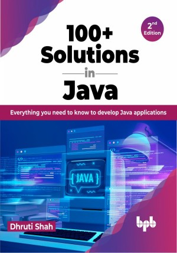

# 100+ Solutions in Java - 2nd Edition

A step-by-step guide to Java development for beginners and professionals

This is the repository for [100+ Solutions in Java - 2nd Edition
](https://bpbonline.com/products/100-solutions-in-java-2nd-edition?variant=42967546396872),published by BPB Publications.

## About the Book
100+ Solutions in Java is a comprehensive and accessible guide to developing Java applications from version 8 to 19. Whether you are a beginner or a seasoned pro, this book will help you learn the latest Java features and best practices, one step at a time.

The book covers a wide range of topics, from basic programming concepts to advanced topics like concurrency and design patterns. Each chapter has clear and concise explanations, helpful examples, and practical exercises.

By the end of the book, you'll be able to develop sophisticated Java applications that are both efficient and reliable.

## What You Will Learn
• Explore the newly introduced features in Java 8 to 19.

•  Gain a deep understanding of the Java Stream API.

•  Master the art of working with Java regular expressions.

•  Get a comprehensive overview of inheritance and interfaces in Java.

•  Familiarize yourself with design patterns in Java.

